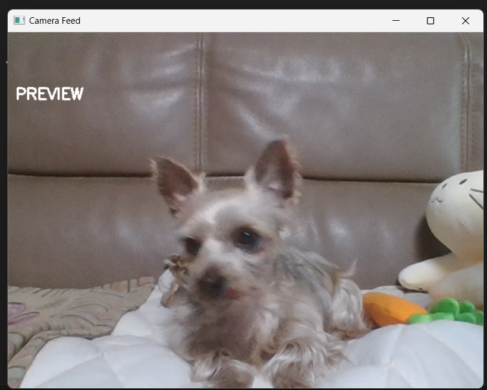

# old fashioned camera 프로그램 기능 및 설명

## 개요
old fashioned camera 는 OpenCV를 활용하여 웹캠을 제어하고 녹화 및 2가지의 화면 필터 기능을 제공합니다. 사용자는 실시간 카메라 피드를 보면서 gray mode와 low quality mode를 적용할 수 있습니다. 
#### 이 프로그램 속 흑백 모드와 저화질 모드를 활용하여 옛스러운 느낌, 과거에 찍은 듯한 오묘한 분위기를 가진 영상물을 얻을 수 있을 것입니다.


## 기능 설명

### 1. 카메라 피드 및 종료 기능
- 프로그램 실행 시 기본 웹캠을 활성화하여 실시간 영상을 출력합니다.
- `ESC` 키를 누르면 프로그램이 종료됩니다.

### 2. 녹화 기능
- `Space` 키를 눌러 녹화를 시작하거나 중지할 수 있습니다.
- 녹화하지 않을 때에는 화면에 preview글씨가 나타납니다. (녹화 영상에는 포함되지 않는 텍스트임)
- 녹화 중일 때 화면 좌측 상단에 빨간 점이 깜빡입니다.
- 녹화된 영상은 `old fashioned camera video.avi` 파일로 저장됩니다.
- 코덱 설정: `XVID` 코덱을 사용하여 `AVI` 형식으로 저장됩니다.
- FPS 설정: 녹화는 `20.0 FPS`로 저장됩니다.



### 3. 흑백 모드 (Gray Mode)
- `g` 키를 눌러 흑백 모드를 켜거나 끌 수 있습니다.
- 흑백 모드가 활성화되면 실시간 영상 뿐만 아니라 녹화 영상에도 흑백으로 영상이 저장됩니다.

### 4. 저화질 모드 (Low Quality Mode)
- `l` 키를 눌러 저화질 모드를 켜거나 끌 수 있습니다.
- 저화질 모드가 활성화되면 영상이 축소된 후 다시 확대되어 픽셀화 효과가 적용됩니다.

### 5. 녹화 표시 기능
- 녹화 중일 때 화면 좌측 상단에 빨간 점이 깜빡이며 녹화 상태를 나타냅니다.
- 20프레임 간격으로 깜빡이도록 설정하였습니다.

## 전체적인 프로그램 코드 설명

### 1. OpenCV 초기화 및 비디오 설정
```python
cap = cv2.VideoCapture(0)  # 기본 웹캠 활성화
fourcc = cv2.VideoWriter_fourcc(*'XVID')  # 코덱 설정 (avi 파일 저장용)
out = None  # 녹화 객체 초기화
```

### 2. 주요 변수
- `recording`: 녹화 상태 여부를 저장하는 변수
- `gray_mode`: 흑백 모드 활성화 여부
- `low_quality_mode`: 저화질 모드 활성화 여부
- `blink_counter`: 녹화 중 빨간 점을 깜빡이게 하기 위한 카운터

### 3. 실시간 카메라 피드 처리
- 카메라에서 프레임을 읽고, `gray_mode` 또는 `low_quality_mode`가 활성화된 경우 해당 효과를 적용합니다.
- `recording`이 활성화된 경우, 영상을 저장합니다.

### 4. 키 입력 처리
```python
key = cv2.waitKey(1) & 0xFF
if key == 27:  # ESC 키 -> 프로그램 종료
    break
elif key == 32:  # Space 키 -> 녹화 시작/중지
    if not recording:
        out = cv2.VideoWriter('old fashioned style video.avi', fourcc, 20.0, (frame.shape[1], frame.shape[0]))
        recording = True
        blink_counter = 0
    else:
        out.release()
        recording = False
elif key == ord('g'):  # 'g' 키 -> 흑백 모드 토글
    gray_mode = not gray_mode
elif key == ord('l'):  # 'l' 키 -> 저화질 모드 토글
    low_quality_mode = not low_quality_mode
```

## 키보드 명령어 정리
| 키 | 기능 |
|----|------|
| `ESC` | 프로그램 종료 |
| `Space` | 녹화 시작과 중지 |
| `g` | gray 모드 토글 |
| `l` | low quality 모드 토글 |

---

